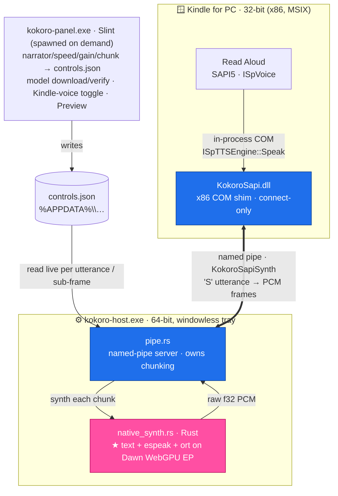

# Architecture

How kokoro-kindle-reader works under the hood, and how to build it from source. For
installation and day-to-day use, see the [README](README.md).

Local, offline text-to-speech built on [Kokoro-82M](https://huggingface.co/onnx-community/Kokoro-82M-v1.0-ONNX),
synthesized **natively on the Dawn WebGPU** execution provider of ONNX Runtime (the
same Dawn that Chrome/WebView2 ship) — **no browser, no WebView2, no C++**. The synth
core is pure Rust: the `ort` crate drives the model on the WebGPU EP and espeak-ng is
reached over a thin FFI. It serves two front ends:

1. **A native settings panel** (Slint) — pick a narrator, tune speed and volume, and
   audition it with a Preview button (there's no free-text reading box; the app's job
   is choosing/hosting the voice, not reading pasted text). A checkbox toggles whether
   Kindle narrates with Kokoro. The panel is spawned on demand from the tray; nothing UI
   is resident at idle.
2. **A SAPI5 voice for Windows** — "Kokoro (SAPI5)" appears in the system voice list,
   so apps like **Kindle for PC Read Aloud** narrate books with Kokoro. A thin **x86**
   COM DLL that Kindle loads in-process forwards each utterance over a named pipe to
   the running host, which synthesizes on the GPU and returns audio.



`kokoro-host` is the only place audio is produced. It runs windowless in the system
tray, hosts the named pipe that bridges Kindle's SAPI engine to the native synth, and
reads its settings live from `controls.json`. **The host must be running for Kindle to
speak.**

## How Kindle reads with Kokoro (the engine chain)

The trick is letting a 32-bit app drive GPU TTS that lives in a *different*, 64-bit
process. It does **not** connect to anything in the networking sense — COM loads our
DLL straight into Kindle and calls its functions:

1. **SAPI5 is a registry-discovered COM plugin.** `DllRegisterServer`
   (`kokoro-sapi/src/lib.rs`) writes `CLSID\{guid}\InprocServer32` → the DLL's path, and a voice token
   `…\Speech\Voices\Tokens\KokoroTTS` whose `CLSID` points back at that GUID. The
   32-bit `regsvr32` lands these in `WOW6432Node`, the view 32-bit Kindle reads.
2. **Kindle loads the DLL in-process.** It resolves its default voice token → CLSID →
   `CoCreateInstance(CLSCTX_INPROC_SERVER)` → COM `LoadLibrary`s `KokoroSapi.dll` into
   *Kindle's* address space and calls `ISpTTSEngine::Speak`. This is why the engine
   **must be x86** (matching Kindle) and a native COM DLL — and why it stays a separate
   file from the x64 host.
3. **The DLL is a thin shim → the host.** `Speak` sends the *whole* utterance over the
   pipe `\\.\pipe\KokoroSapiSynth` (wire format: the `kokoro-protocol` crate) in one `'S'` request
   (`[rate][textBytes][text]`) and gets back a **stream** of PCM frames
   (`[nSamples][gain][f32…]`, ended by a `STREAM_END` / `SYNTH_ERROR` marker — the u32
   sentinels `0xFFFF_FFFE` / `0xFFFF_FFFF`). `kokoro-host`'s `pipe.rs` owns the
   chunking: it splits the text, renders each chunk on the native Dawn WebGPU synth,
   and streams the PCM back; the engine just writes each frame to Kindle's audio site.
4. **Voice selection — and the Kindle 1.0.18632.0 change.** Historically Kindle narrated
   with whichever token equals `DefaultTokenId` in its **private hive**
   (`…\Packages\AMZNKindle…\SystemAppData\Helium\User.dat`, not real HKCU);
   `kindle-voice-guard.ps1 -Set kokoro|david` points it at Kokoro (the installer runs it).
   **But Kindle 1.0.18632.0 (2026-07) rewrote its narrator** (`SpVoiceEngine` in
   `xrm120.dll`): it now resolves the voice from the **WinRT `SpeechSynthesizer` default**
   (Microsoft Zira) and applies it via `ISpVoice::SetVoice`, ignoring `DefaultTokenId`
   entirely. So on 18632+ the guard is a no-op; the hook below restores Kokoro. The panel's
   checkbox now just records `kindle_kokoro` in `controls.json` (no elevation), which gates
   the hook.

### Restoring Kokoro on Kindle 1.0.18632.0+ (the hook)

Because 18632's narrator is still classic `ISpVoice`, the fix is to change *which token
reaches `SetVoice`*. `kokoro-host`'s watcher (`kindle_watch.rs`) polls for `Kindle.exe` on a
4 s timer and, when `kindle_kokoro` is on, spawns the x86 **`kokoro-inject.exe`**, which
`LoadLibrary`-injects **`kokoro_hook.dll`** into Kindle. The hook patches the process-shared
`ISpVoice` vtable slot for `SetVoice` (**index 18**) so whatever token Kindle requests (Zira)
is replaced with the Kokoro token — after which Kindle loads `KokoroSapi.dll` and the chain
above runs unchanged. The host is x64, so it can't inject directly (the injector must match
Kindle's bitness); it spawns the x86 helper instead. The patch is in-memory only, re-applied
on each Kindle launch. `kokoro-hook`'s `selftest` bin guards the slot-18 ABI.

**Native synthesis.** `native_synth.rs` is the pure-Rust synth core: `text.rs`
normalize/segment → `espeak.rs` phonemize (espeak-ng FFI) → tokenize → the Kokoro ONNX
model on the ORT `ort` crate (load-dynamic against the staged `onnxruntime.dll`), on
either the **Dawn WebGPU** EP (the default) or the plain **CPU** EP — a manual
`gpu_synth` flag in `controls.json` (the panel's "Synthesize on GPU" checkbox, on by
default), since an integrated GPU can badly lose to CPU (the standalone
`kokoro-bench` tool found 0.50x realtime on WebGPU vs. 1.07x on CPU fp32 on an Intel
UHD 620; no auto-detection between the two yet). espeak keeps global
state and isn't thread-safe (and
the `ort` session lives here), so all synthesis is **serialized onto one dedicated
worker thread** that owns the session for the process lifetime; requests arrive over an
mpsc channel and replies come back on tokio oneshots so the async pipe tasks never
block. One model limit shapes the code: **the Kokoro ONNX graph fails its BERT `Expand`
node past ~510 tokens**, so each chunk's tokens are sub-split into `MAX_CONTENT_TOKENS`
(500) windows, each wrapped in its own BOS/EOS, and the resulting PCM concatenated. A run
also retries a couple of times — rebuilding the session on the last try — to ride out a
transient Dawn device error.

**Streaming.** `pipe.rs` synthesizes **sentence by sentence**, with chunk sizes that
**ramp 1, 2, 4, … up to the `chunk` setting**: a tiny first chunk gets audio started fast,
then doubling builds a play buffer so the synth pipeline never starves. A **depth-1
prefetch pipeline** renders chunk N+1 while chunk N streams back, bounded by pipe
backpressure. The engine writes each frame to the host in ~250 ms blocks, so there's no
gap at chunk boundaries and `SPVES_ABORT` stops playback promptly (it closes the pipe,
which cancels the rest of the stream). (Gaps *between Kindle pages* are Kindle's own
page-turn time — each page is a fresh `Speak`.)

**SAPI events.** Each chunk is prefixed on the wire with a `CHUNK_INFO` frame
(`0xFFFF_FFFD` + the chunk's UTF-16 span + its sample count), which lets the engine map a
character position linearly onto that chunk's audio and so report `SPEI_WORD_BOUNDARY` /
`SPEI_SENTENCE_BOUNDARY` / `SPEI_TTS_BOOKMARK` at their **true audio-stream offsets**.
This is not cosmetic: **Kindle 18632's narrator is event-driven**
(`WordBoundaryListHandler` + bookmark matching in `xrm120.dll`), and without these events
it speaks the first sentence of a page and never advances. Relatedly, if the host reports
a mid-stream `SYNTH_ERROR` *after* audio was already delivered, `Speak` ends with `S_OK`
so Kindle finishes the delivered audio and turns the page rather than halting.

**Volume responsiveness (Kindle path).** Gain/volume is baked into the int16 samples
that sit in Kindle's audio buffer ahead of the speaker, so a naïve implementation lags
a slider move by a whole buffered chunk. `pipe.rs` counters this by **pacing** its
sends to ~real time (keeping at most a fixed lead of audio queued ahead) and
**sub-framing** each chunk, re-reading the current gain from `controls.json` per
sub-frame. The lead (500 ms) and sub-frame (250 ms) are fixed built-in defaults
(`DEFAULT_LEAD_MS` / `DEFAULT_SUBFRAME_MS` in `pipe.rs`); the narrator, speed, gain,
per-chunk sentence count, and GPU/CPU engine choice are the user-facing knobs.

## Layout

| Path | What |
|---|---|
| `kokoro-host/` | The windowless tray host (x64): `main.rs` (tao event loop + tray + `auto-launch` + Kindle-watcher tick), `pipe.rs` (named-pipe server; owns chunking + prefetch + pacing), `native_synth.rs` (serialized Rust synth, GPU or CPU EP + `controls.json` reader) + `text.rs`/`espeak.rs` (kokoro-js text normalizer + espeak-ng FFI), `split_text.rs` (the sentence-chunk splitter), `kindle_watch.rs` (polls for Kindle, spawns the injector). `build.rs` links the espeak-ng import lib and stages the runtime DLLs + `espeak-ng-data`. |
| `kokoro-panel/` | The native settings panel (Slint/Fluent): `ui/panel.slint` + `src/main.rs`, the framework-agnostic `download.rs` / `preview.rs`, and `kindle_reader.rs` (hands-free Ctrl+A toggle of Kindle's Read Aloud + closing Kindle after the narration-voice checkbox, both via raw Win32/Toolhelp32 — UI Automation is only for best-effort state readback). Writes `controls.json`. |
| `kokoro-bench/` | Standalone GPU-vs-CPU synth timing tool, not part of the shipping app: reuses `kokoro-host/src/{text,espeak}.rs` via `#[path]` includes (`kokoro-host` is bin-only, no lib target). |
| `kokoro-hook/` | x86 `cdylib` injected into Kindle 18632+: `DllMain` patches the shared `ISpVoice::SetVoice` vtable slot (index 18) → Kokoro token. `selftest` bin proves it Kindle-free. |
| `kokoro-inject/` | x86 exe the host spawns: `LoadLibrary`-injects `kokoro_hook.dll` into `Kindle.exe`. |
| `native-deps/` | Synth **dependency provisioning** only (no source): `fetch-deps.ps1` populates the gitignored dep folders alongside itself (`native-deps/runtime/` + `espeak-ng-src/`) — the Dawn/WebGPU runtime DLLs (from the `onnxruntime-webgpu` wheel) + espeak-ng (x64 build + import lib + `espeak-ng-data`). |
| `kokoro-sapi/` | The x86 SAPI engine — a Rust `cdylib` (thin COM shim + pipe client, no deps): `lib.rs` (COM exports + registration), `engine.rs` (`ISpTTSEngine`), `worker.rs` (pipe client), `sapi.rs` (hand-declared `sapiddk.h` interfaces). Plus the `voice-setup.ps1` / `kindle-voice-guard.ps1` (Kindle hive patch) / `test-speak.ps1` scripts. |
| `kokoro-sapi-smoke/` | No-Kindle COM + Speak smoke test for the engine (`run-speak-test.ps1`). |
| `kokoro-protocol/` | The named-pipe wire constants (pipe name, `'S'`/`'I'`, `STREAM_END`/`SYNTH_ERROR`, sample rate) as a small crate shared by **both** `kokoro-host` and `kokoro-sapi` — the single source of truth for the format. |
| `model-manifest.json` | Files the model downloads from HF (paths + sizes + SHA-256); embedded in `kokoro-panel` (the narrator list is derived from it). |
| `icons/` | Shared app icons (LFS); embedded in the exes' version resource and the installer. |
| `packaging/` | `installer.nsi` + `build-installer.ps1` (standalone NSIS build) — per-user install with self-elevating voice registration. See [`packaging/README.md`](packaging/README.md). |

## Building from source

Prerequisites: Rust (x64 + the `i686-pc-windows-msvc` target for the SAPI DLL), Visual
Studio with the MSVC toolchain + CMake, Python (for the onnxruntime-webgpu wheel), and
[NSIS](https://nsis.sourceforge.io/) (for the installer). Get the source by **cloning
with Git LFS** — not from a release's auto-generated "Source code" archive, which
doesn't resolve LFS (see [DEVELOPMENT.md](DEVELOPMENT.md)).

```powershell
# 1. One-time: provision the synth runtime deps
#    (Dawn runtime DLLs + espeak-ng x64 import lib/DLL + espeak-ng-data)
.\native-deps\fetch-deps.ps1
rustup target add i686-pc-windows-msvc   # for the x86 SAPI DLL

# 2. Build + run the headless host (tray). Right-click the tray → Settings for the panel.
cargo run --manifest-path kokoro-host\Cargo.toml
cargo run --manifest-path kokoro-panel\Cargo.toml   # or launched from the tray

# 3. The x86 SAPI engine (Rust cdylib, no third-party deps) — for a real Kindle test
cargo build --release --target i686-pc-windows-msvc --manifest-path kokoro-sapi\Cargo.toml

# Register the voice (ELEVATED; the 32-bit regsvr32 is the one that matters)
C:\Windows\SysWOW64\regsvr32.exe "kokoro-sapi\target\i686-pc-windows-msvc\release\KokoroSapi.dll"
```

The TTS model (~430 MB: `onnx/model.onnx`, voices, config/tokenizer) is **downloaded by
the panel** on first run into the app-data dir — no manual asset step.

To build the packaged installer (release-builds both crates, stages everything, and
runs `makensis`):

```powershell
.\packaging\build-installer.ps1
```

CI does this on a `v*` tag (`.github/workflows/installer.yml`); the `sapi.yml` workflow
builds the DLL + runs the COM smoke test on engine changes, and `hook.yml` compile-checks
the x86 hook + injector on their changes.

## Kindle for PC notes (technical)

- Kindle is **32-bit MSIX**; the engine (and the hook + injector) must be x86, and the
  engine is registered under `WOW6432Node` (the 32-bit `regsvr32` does this). Its
  `DefaultTokenId` lives in the package hive; the installer points it at Kokoro at install
  and reverts to Microsoft David on uninstall. **On Kindle 1.0.18632.0+ that `DefaultTokenId`
  no longer selects the voice** — the narrator uses the WinRT default, so the host's watcher
  injects `kokoro_hook.dll` to force Kokoro instead (see "Restoring Kokoro…" above). Reopen
  Kindle after toggling the checkbox (the hook applies on Kindle's next launch).
- **The host must be running** when Kindle reads — it's the synthesizer. If it isn't,
  the voice is silent (the shim has no local fallback by design).
- Don't move/delete `kokoro-sapi/` — the registered token references the DLL by path.
